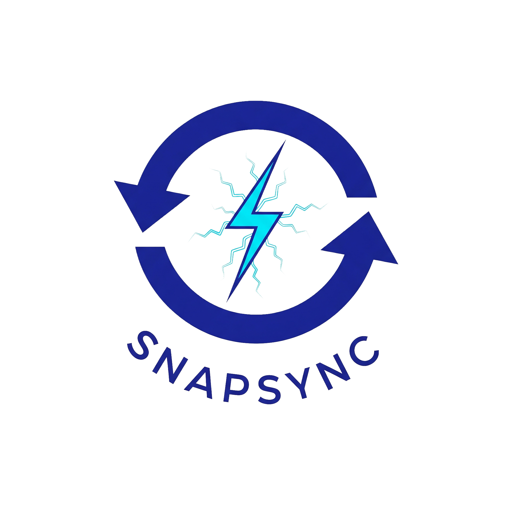

# SnapSync

<div align="center">



**Fast, reliable LAN file transfers over TCP — with discovery, resume, and end-to-end integrity.**

[](https://golang.org)
[](LICENSE)
[]()
[]()
[](https://discord.gg/nnkfW83n)

</div>

---

SnapSync is a LAN file transfer CLI for reliable single-file transfers over TCP with peer discovery, resume support, and end-to-end integrity checks.

## Requirements

- Go 1.22+

## Build

```bash
make build
```

## Quick Start

**Machine A — Receiver:**

```bash
./bin/snapsync recv --out ./downloads --accept
```

**Machine B — Sender:**

```bash
./bin/snapsync list --timeout 2s
./bin/snapsync send ./20GB.iso --to <peer-id>
```

## Commands

| Command | Description |
|---------|-------------|
| `snapsync recv` | Start receiver and listen for incoming transfers |
| `snapsync send <path> --to <peer-id\|host:port>` | Send a file to a discovered peer |
| `snapsync list` | List active receivers on the LAN |
| `snapsync version` | Print version information |

**`recv` flags:** `--listen :45999` `--out <dir>` `--accept` `--overwrite` `--no-discovery` `--no-resume` `--keep-partial` `--force-restart` `--break-lock`

**`send` flags:** `--to <peer-id|host:port>` `--timeout 2s` `--name <override>` `--no-resume`

**`list` flags:** `--timeout 2s` `--json`

## Features

### 🔍 Peer Discovery
Receivers advertise on `_snapsync._tcp.local` while running. `snapsync list` shows discovered peers with ID, name, addresses, port, and age.

### ✅ Integrity Verification
SnapSync verifies transfer integrity before finalizing output. Corrupted transfers fail and incomplete outputs are removed automatically.

### ⏸ Resume Transfers
If a transfer is interrupted, SnapSync resumes automatically. Partial transfers are stored as `*.partial` with a metadata sidecar `*.partial.snapsync`. Integrity is re-verified on completion before finalizing.

## Troubleshooting

| Problem | Solution |
|---------|----------|
| Discovery not working | Verify both hosts are on the same subnet and multicast DNS is allowed by the firewall |
| Connection failures | Ensure the receiver port is open and reachable |
| Lock busy errors | Another transfer is using the same target; retry or use `--break-lock` if the lock is stale |
| Integrity failures | Transfer was corrupted in transit or on disk; rerun send |

## Known Limitations

- No folder transfer yet (files only)
- No encryption / authentication yet
- Discovery is intended for same-subnet LAN environments

## License

SnapSync is released under the **[NC-OSL v1.0](LICENSE)** — Non-Commercial Open-Source License.

- ✅ Free to use, modify, and distribute
- ✅ Derivatives must remain open-source under the same license
- ❌ Commercial use requires a separate written license

© 2026 [Pomai / Pomaieco](https://github.com/pomaieco/spriteforge)
